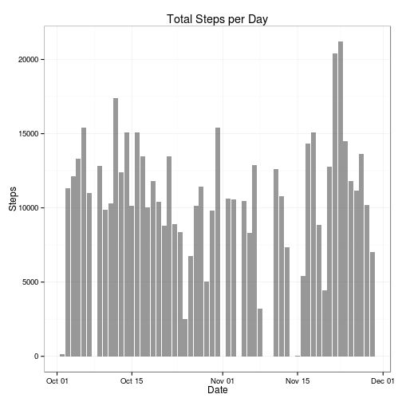
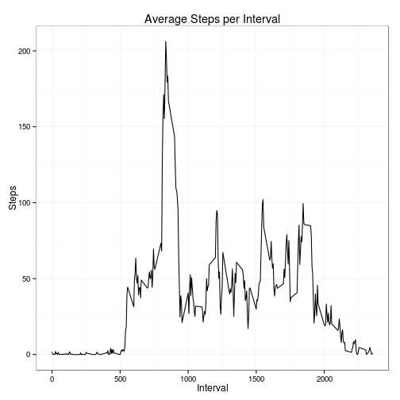
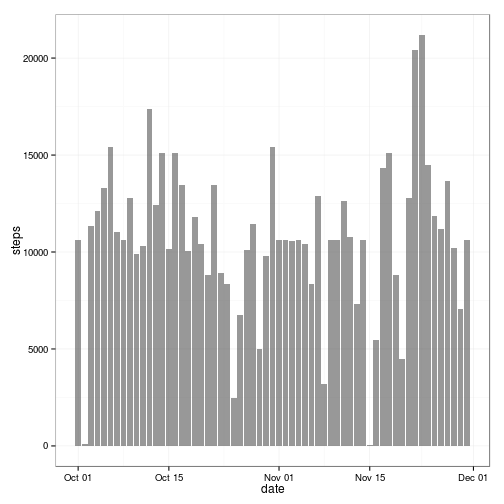
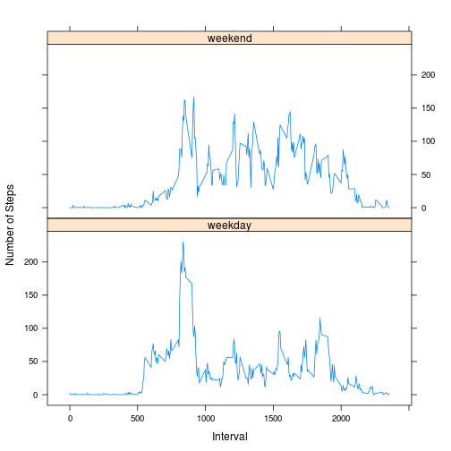

## Loading and preprocessing the data


```r
library(ggplot2)

#If csv files doesn't exist. lets unzip the activity.zip
if(!file.exists("activity.csv")){
    unzip("activity.zip")
}

#Load the file.
data <- read.csv("activity.csv",na.strings="NA",header = TRUE)

datawithoutna <- na.omit(data);

activitywithdates = transform(datawithoutna,date = as.Date(date,format("%Y-%m-%d")))
```


## What is mean total number of steps taken per day?

```r
activitysumperdate <- aggregate(data = activitywithdates,steps ~ date,FUN=sum)

ggplot(activitysumperdate, aes(x=date,y=steps)) + geom_bar(stat="identity",alpha=0.5) +theme_bw()+ggtitle("Total Steps per Day") + labs(x="Date") + labs(y="Steps")
```

 

The above graph shows the histogram of total no of steps taken per day. 

The important summary metric for the observations are as follows :-  

  *  The mean for steps across all days is 10766.19  
  *  The median for steps  10765.00


## What is the average daily activity pattern?

The graph below tries to show the average activity during various intervals of the date.


```r
activityintervalmean = aggregate(data=datawithoutna,steps ~ interval,FUN=mean)

ggplot(activityintervalmean,aes(interval,steps))+geom_line() +theme_bw()+ggtitle("Average Steps per Interval") + labs(x="Interval") + labs(y="Steps")
```

 

As you can from the graph, the maximum steps of 206.1698113(mean value) is available around the 5 minute interval of 835


## Imputing missing values

The number of rows with NA are 2304

The strategy used for missing values is replace the same with the mean of the same interval across all days.

Lets us now plot the histogram of new datasets with fixed missing values.


```r
library(plyr)

newdata<-ddply(data, ~interval, transform, steps = replace(steps,is.na(steps),floor(mean(steps,na.rm=TRUE))))

activitywithdates = transform(newdata,date = as.Date(date,format("%Y-%m-%d")))


activitysumperdate = aggregate(data = activitywithdates,steps ~ date,FUN=sum)

ggplot(activitysumperdate, aes(x=date,y=steps)) + geom_bar(stat="identity",alpha=0.5) +theme_bw()
```

 

After adding the missing values, the summary metrics are as follows:-  

  *  The mean for steps across all days is 10749.77  
  *  The median for steps  10641.00

As you can see from the current various previous values, both mean and median and moved marginally only. Which means it doesn't disturbed the overall sample characteristics.

## Are there differences in activity patterns between weekdays and weekends?

The below graph shows the differences in activity patterns between weekdays and weekends. The graphs shows the higher peaks across 800th interval. An observation that is common with the graph earlier. But at the same time, it shows the marked drop on physical activity on weekends.


```r
temp <- (weekdays(activitywithdates$date) %in% c("Sunday","Saturday"))
activitywithdates$week <- weekdays(activitywithdates$date)
activitywithdates$dow <- factor(temp,labels=c("weekday","weekend"))

activityintervalmean = aggregate(data=activitywithdates,steps ~ interval + dow,FUN=mean)

library(lattice)
xyplot(activityintervalmean$steps ~ activityintervalmean$interval|activityintervalmean$dow,activityintervalmean,type="l",
       layout=c(1,2),xlab="Interval",ylab="Number of Steps")
```

 


